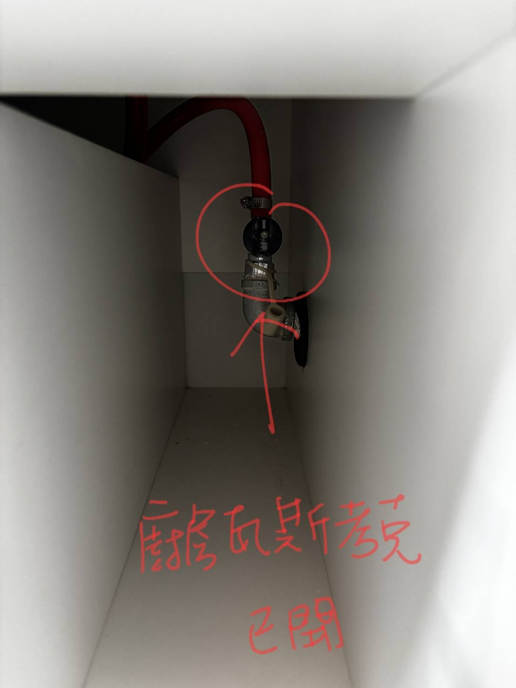
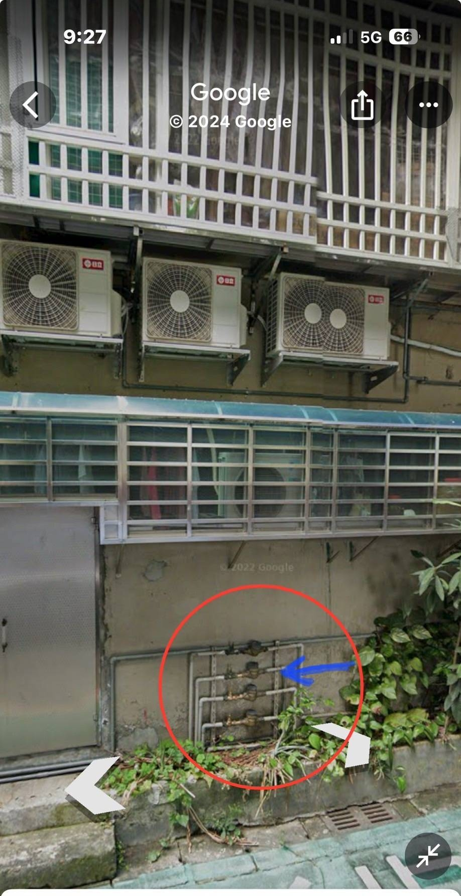

# Memo

- [Memo](#memo)
  - [1. To-Do](#1-to-do)
  - [2. 廚房](#2-廚房)
    - [2.1 廚房瓦斯管線開關](#21-廚房瓦斯管線開關)
    - [2.2 櫻花濾水管更換教學](#22-櫻花濾水管更換教學)
  - [3. 儲藏室](#3-儲藏室)
  - [4. 書房](#4-書房)
  - [5. 次臥](#5-次臥)
  - [6. 主臥](#6-主臥)
  - [7. 主衛](#7-主衛)
  - [8. 客衛](#8-客衛)
  - [9. 客餐廳](#9-客餐廳)
  - [10. 家電](#10-家電)
  - [11. 其他](#11-其他)
    - [11.1 家庭水管開關](#111-家庭水管開關)

[回首頁](../README.md)

---

## 1. To-Do

[TOP](#memo)

---

## 2. 廚房

### 2.1 廚房瓦斯管線開關

[TOP](#memo)

### 2.2 櫻花濾水管更換教學

[櫻花濾水管更換教學](櫻花濾水管更換教學.mp4)

[TOP](#memo)

---

## 3. 儲藏室

[TOP](#memo)

---

## 4. 書房

[TOP](#memo)

---

## 5. 次臥

[TOP](#memo)

---

## 6. 主臥

[TOP](#memo)

---

## 7. 主衛

[TOP](#memo)

---

## 8. 客衛

[TOP](#memo)

---

## 9. 客餐廳

[TOP](#memo)

---

## 10. 家電

[TOP](#memo)

---

## 11. 其他

[TOP](#memo)

### 11.1 家庭水管開關

[TOP](#memo)

---

[TOP](#memo)

[回首頁](../README.md)
