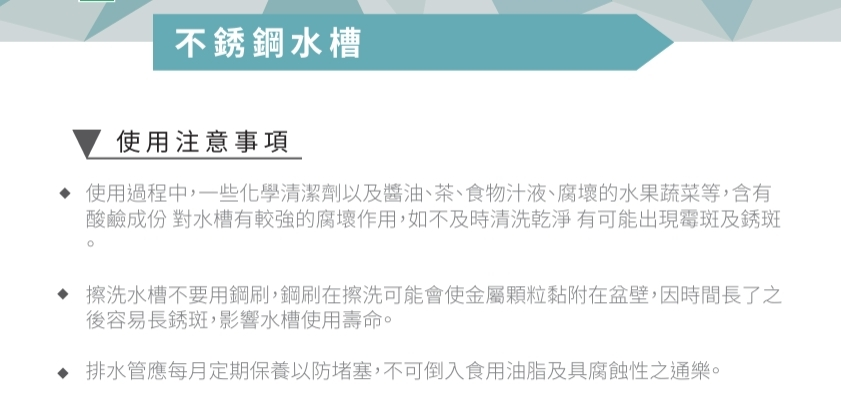
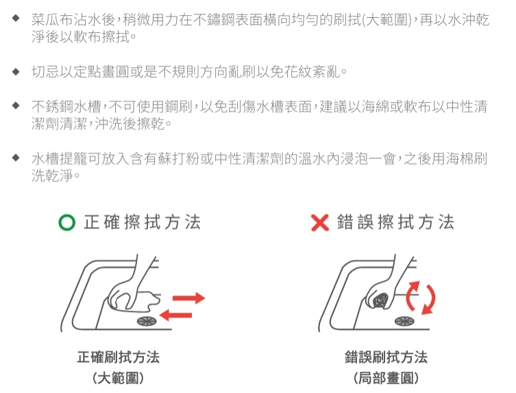

# Memo

- [Memo](#memo)
  - [1. To-Do](#1-to-do)
  - [2. 廚房](#2-廚房)
    - [2.1 廚房瓦斯管線開關](#21-廚房瓦斯管線開關)
    - [2.2 櫻花濾水器](#22-櫻花濾水器)
    - [2.3 廚具維修](#23-廚具維修)
    - [2.4 櫻花廚房流理台](#24-櫻花廚房流理台)
    - [2.5 廠商優惠](#25-廠商優惠)
    - [2.6 不鏽鋼水槽清潔保養](#26-不鏽鋼水槽清潔保養)
  - [3. 儲藏室](#3-儲藏室)
  - [4. 書房](#4-書房)
  - [5. 次臥](#5-次臥)
  - [6. 主臥](#6-主臥)
  - [7. 主衛](#7-主衛)
  - [8. 客衛](#8-客衛)
  - [9. 客餐廳](#9-客餐廳)
  - [10. 家電](#10-家電)
  - [11. 其他](#11-其他)
    - [11.1 家庭水管開關](#111-家庭水管開關)

[回首頁](../README.md)

---

## 1. To-Do

- [ ] 測試冷氣功能
- [ ] 自行檢查全室 將膠帶貼在需要補漆修補的地方 樂逸會請油漆工來修補
- [ ] 儲藏室陽台外推附近的木架 自行拆除
- [ ] 

[TOP](#memo)

---

## 2. 廚房

### 2.1 廚房瓦斯管線開關

[TOP](#memo)

### 2.2 櫻花濾水器

[櫻花濾水管更換教學](櫻花濾水管更換教學.mp4)

櫻花的濾水管 在更換時可以選擇找原廠或是店家

1. 原廠申請會家中安裝
2. 店家提供八五折優惠 但是需要自行安裝

建議在濾水管上使用麥克筆寫上安裝日期 一般大約九個月左右需要更換

濾水器下的盒裝內有棉墊 如果濾水器漏水時 棉墊會因浸溼偵測到漏水而將濾水器斷路 發現漏水時需要盡快申請維修

### 2.3 廚具維修

櫻花廚具維修建議找原廠較快 找安裝店家也可以但會較慢(需要店家安排出維修時間)

[櫻花廚具廠商: 櫻花整體廚房 世貿店](https://maps.app.goo.gl/mV53GRppBVcgHHTG8)

### 2.4 櫻花廚房流理台

廚房流理臺為焊上的 基本上不會漏水 但請勿直接放置冰凍物於上退冰 冰霜會造成檯面下櫃體結霜潮濕發霉

流理臺若是發現漏水 立即連繫廚具廠商維修

### 2.5 廠商優惠

櫻花廚具廠商可以採購 "Day and day產品85折"
[Day and day](https://www.daynday.com.tw/dayday/cate/1)

### 2.6 不鏽鋼水槽清潔保養

[TOP](#memo)

---

## 3. 儲藏室

[TOP](#memo)

---

## 4. 書房

[TOP](#memo)

---

## 5. 次臥

[TOP](#memo)

---

## 6. 主臥

[TOP](#memo)

---

## 7. 主衛

[TOP](#memo)

---

## 8. 客衛

[TOP](#memo)

---

## 9. 客餐廳

[TOP](#memo)

---

## 10. 家電

[TOP](#memo)

---

## 11. 其他

[TOP](#memo)

### 11.1 家庭水管開關

[TOP](#memo)

---

[TOP](#memo)

[回首頁](../README.md)
